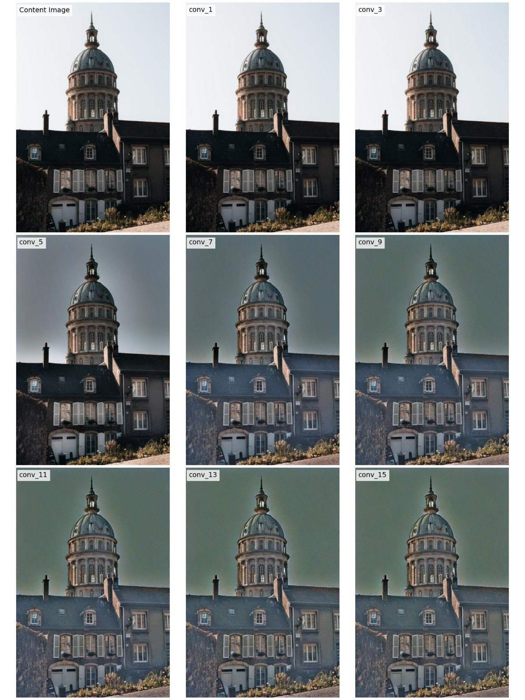
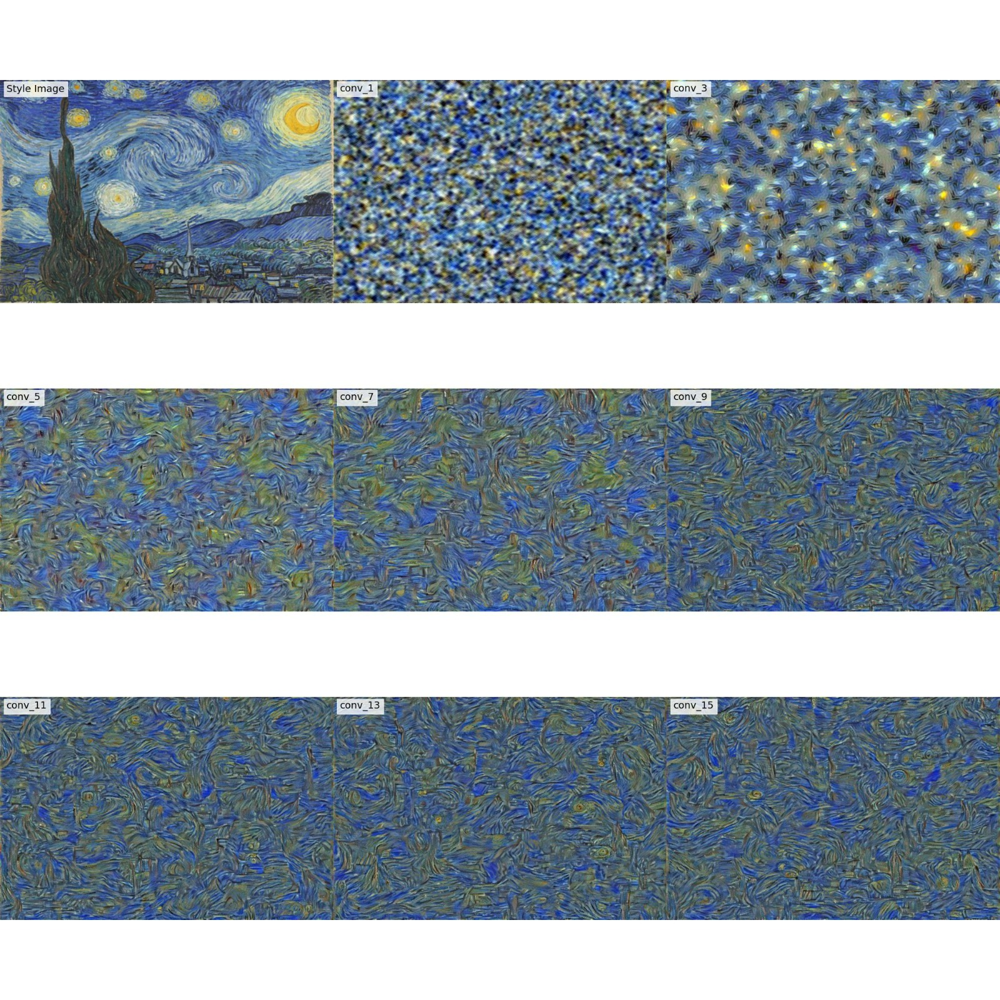
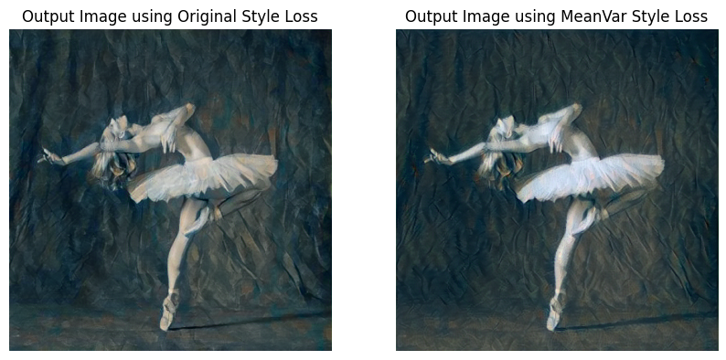

# style-diffusion
This project's theme is to manipulate the style of images generated by a pre-trained denoising
diffusion model using a mechanism called classifier guidance.

This task is comprised of two main components:
* A module that computes the style loss of an image (given a style reference image). 
  The style loss computation is done by following the Neural Style-transfer algorithm by Gatys et al.
* A denoising diffusion-based image generator

The first part of the project modifies the style-transfer algorithm to perform feature inversion, text synthesis and using a different style loss.

## Feature Inversion
For this task we use a simple image of a church.
Modifying the neural style transfer algorithm to invert features from different stages of the
VGG-19 network, we get the following results:

We can see that as we go deeper and deeper in the layers, it is
harder to reconstruct the exact features of the image, and the colors
and texture of the reconstruction of images from deeper layers are
different than the original image. This aligns with the logic of feature
inversion: deeper layers tend to have larger receptive fields, which
means they capture more global features. The feature maps at
deeper layers contain less specific information about the exact
arrangement of pixels in the original image. Moreover, deeper layers
of the VGG-19 model consist of more complex features that capture
high-level representations. So, when performing feature inversion, it
becomes challenging to precisely reconstruct these complex
features from noisy initial images.

## Texture Synthesis
For the style image we use the famous Starry Night painting by Van Gogh.
Modifying the neural style transfer algorithm to generate a texture inspired by the style
input, we get the following results:

Here we see that the deeper the layers, the more we capture more of
the style of the original styled image and we get a nice texture and
patterns. This aligns with the texture synthesis logic, since the early
layers capture low-level features such as edges and simple textures,
while the deeper layers capture higher-level features such as
complex textures, object parts, etc.

## MeanVar Style Loss
Here we run the neural style transfer algorithm with a new style loss called "MeanVar", 
which computes and compares the mean and the variance of each activation channel, in a given layer,
instead of the Gram matrix of the layer.

The content image is a ballerina image:

The style image is a picasso painting:

Comparing between the results, we get:

We can see that the patterns of the styled image using MeanVarLoss
(right image) are smoother (less structured) and the ballerina is
whiter and takes less of the patterns of the style image than the
patterns and the ballerina of the styled image using the original style
loss (left image).
One reason for those differences can be that the gram matrix loss
can effectively transfer the color distribution and contrast properties
of the style image to the content image. It captures the relationships
between different color channels and their variations. The mean and
variance loss, being channel-wise, may result in a different color
distribution and contrast in the output image, potentially
emphasizing local color variations or affecting the overall color
balance. This can explain the differences in the colors of the ballerina.
Moreover, The gram matrix loss tends to preserve and transfer largescale textures and patterns from the style image to the content
image. It focuses on capturing the overall style of the image. In
contrast, the mean and variance loss may prioritize smaller-scale
details and variations within the style image. This can result in a
different emphasis on fine textures and subtle patterns. We can see
that in the structure differences of the shapes in the background of
each result.

## Style Guided Diffusion VS Text-To-Image Stable Diffusion
